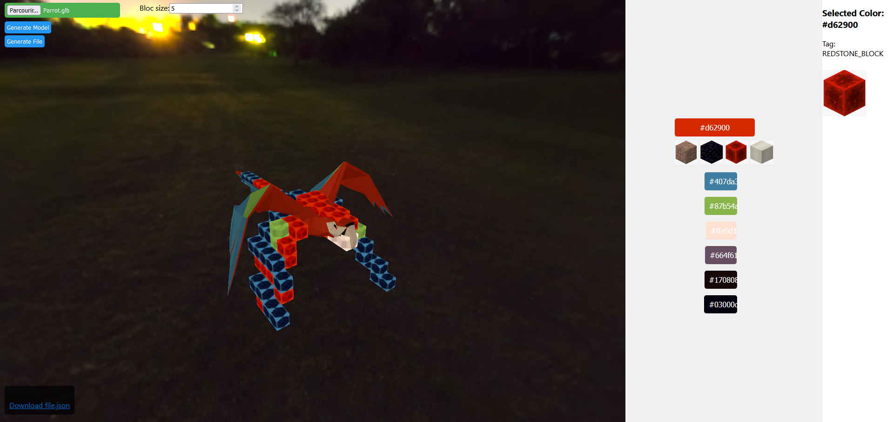

# Voxelisation
Convert an animated GLB 3D model into a file that can be used to make "motion animation" with blocks in minecraft.

# Installation

Requiere npm

`
git clone https://github.com/leteemo/Voxelisation
cd Voxelisation
npm install
npm run start`
